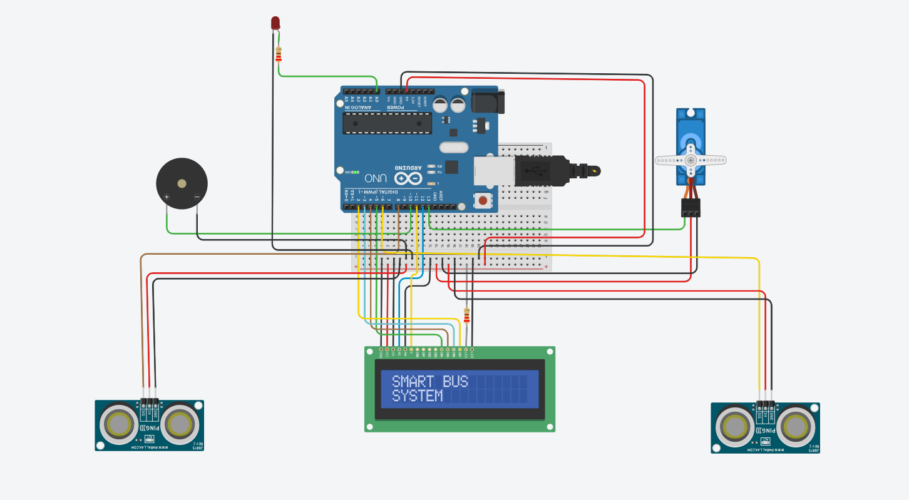
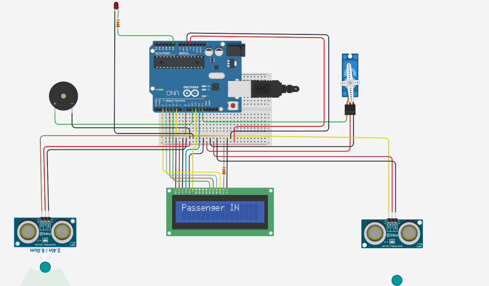
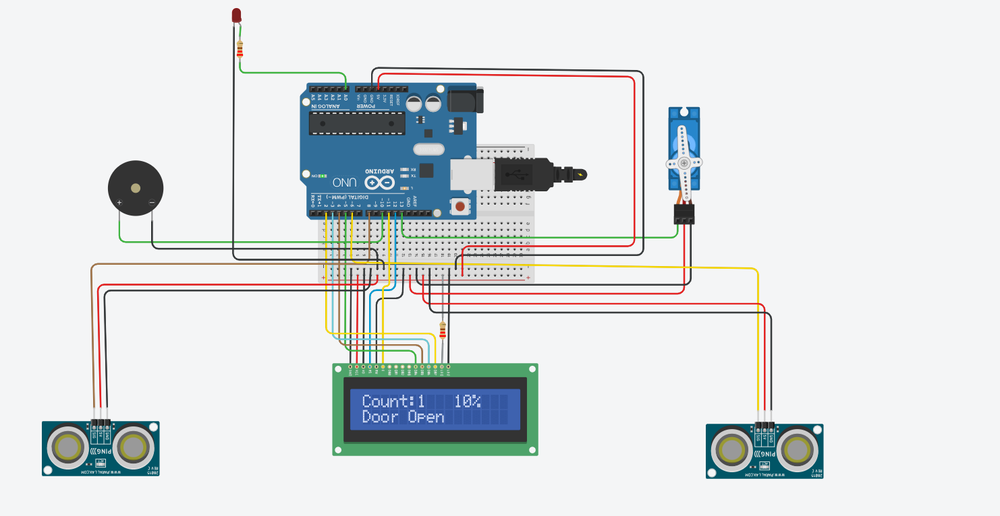
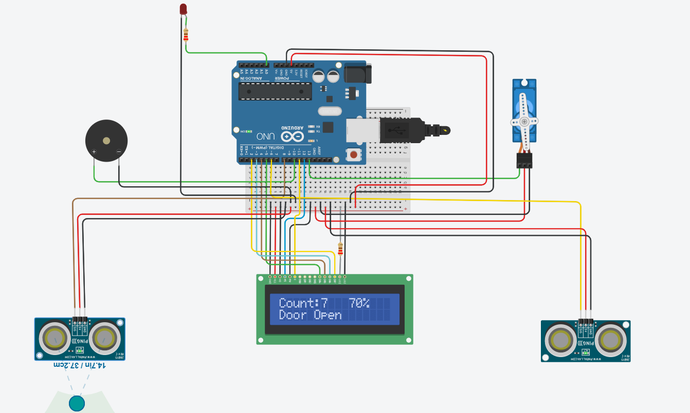
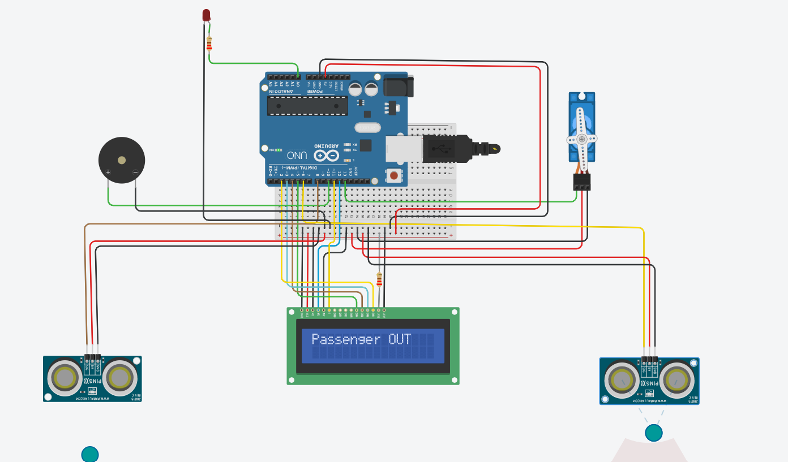
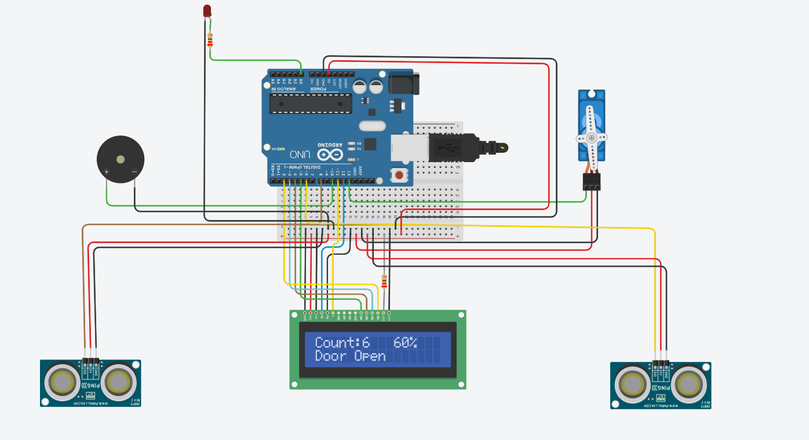
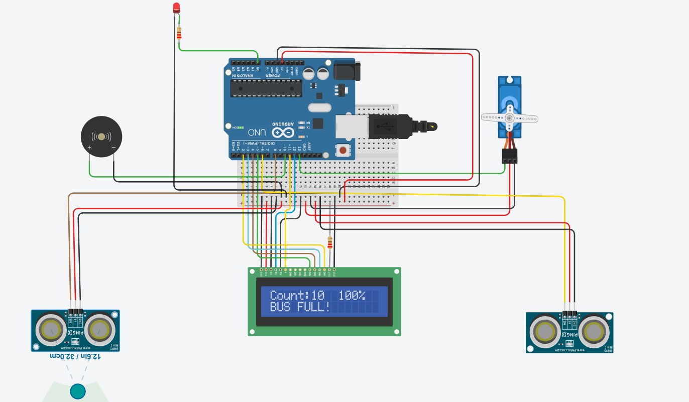
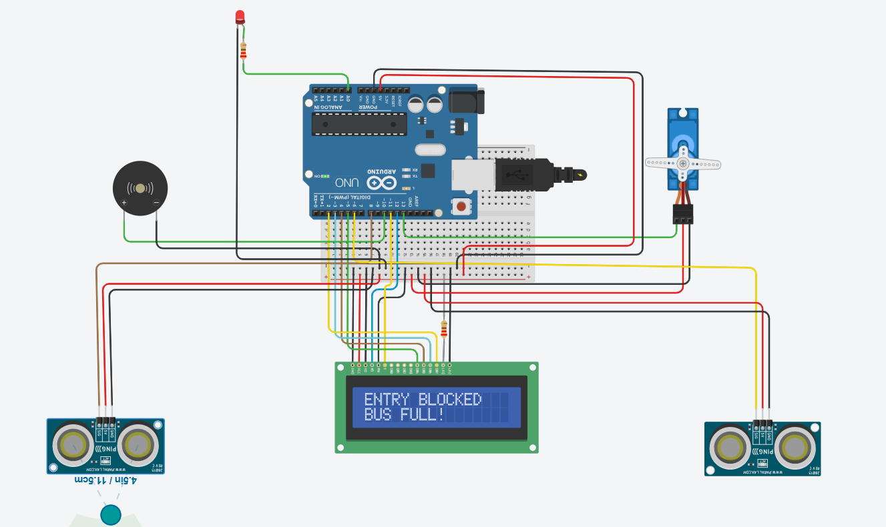

# 🚌 Smart Bus Overcrowding & Passenger Analytics System

## 🚀 Project Overview

The Smart Bus Overcrowding & Passenger Analytics System is an IoT-based transportation monitoring solution developed using Arduino Uno and simulated in Tinkercad.

The system automatically counts passengers entering and exiting the bus, monitors occupancy levels in real time, detects overload conditions, generates emergency alerts, and prevents additional entries when the bus reaches maximum capacity.

This project demonstrates the practical application of Embedded Systems, Sensor Interfacing, Automation Logic, and Smart Transportation Technologies.

---

## 🎯 Problem Statement

Public transportation systems often face overcrowding issues that lead to:

* Passenger discomfort
* Safety concerns
* Inefficient transportation management
* Lack of real-time occupancy monitoring

A smart monitoring system can help transportation authorities maintain passenger safety and optimize bus operations.

---

## 💡 Proposed Solution

This system continuously monitors passenger movement using ultrasonic sensors and calculates the total occupancy inside the bus.

When the passenger count reaches the predefined limit:

* Entry is automatically blocked
* Emergency alerts are activated
* Visual indicators notify passengers and operators

---

## ⚙️ Key Features

✅ Passenger Entry Detection

✅ Passenger Exit Detection

✅ Real-Time Passenger Counting

✅ Occupancy Percentage Monitoring

✅ Bus Full Detection

✅ Emergency Alert System

✅ Automatic Door Locking

✅ Entry Restriction When Capacity Reached

✅ LCD-Based Live Status Display

---

## 🛠️ Components Used

| Component                  | Quantity |
| -------------------------- | -------- |
| Arduino Uno                | 1        |
| Ultrasonic Sensor (PING))) | 2        |
| LCD 16x2 Display           | 1        |
| Servo Motor                | 1        |
| Piezo Buzzer               | 1        |
| LED                        | 1        |
| Breadboard                 | 1        |
| Resistors                  | Multiple |

---

## 💻 Technologies Used

* Arduino Programming
* Embedded Systems
* IoT Concepts
* Sensor Interfacing
* Automation Logic
* Tinkercad Simulation

---

## 🔄 System Workflow

Passenger Enters

⬇️

Entry Sensor Detects Passenger

⬇️

Passenger Count Increased

⬇️

Occupancy Calculated

⬇️

LCD Updated

⬇️

Capacity Check Performed

⬇️

If Capacity Exceeded

➡️ Activate Buzzer

➡️ Turn ON Warning LED

➡️ Lock Door Using Servo Motor

---

## 🔌 Circuit Diagram

The complete hardware circuit consists of an Arduino Uno, ultrasonic sensors for passenger detection, LCD display for monitoring, servo motor for automated door control, and alert mechanisms including buzzer and LED indicators.

---

# 📊 System Demonstration

## Initial System State

The system initializes with passenger count set to zero and all monitoring modules active.

---

## Passenger Entry Detection

A passenger entering the bus is detected by the entry sensor and the count is automatically updated.

---

## Passenger Count Monitoring

The LCD continuously displays the current number of passengers inside the bus.

---

## Passenger Exit Detection

Passengers leaving the bus are detected and the count is reduced automatically.

---

## Updated Passenger Count

The occupancy information is updated dynamically after passenger exit.

---

## 🚨 Bus Full Detection

When the maximum occupancy limit is reached, the system enters overload protection mode.

---

## 🔒 Entry Blocking Mechanism

The servo motor automatically locks the entry gate and prevents further passengers from entering.

---

## 📈 Project Outcomes

* Accurate Passenger Counting
* Automated Occupancy Monitoring
* Smart Overload Detection
* Enhanced Passenger Safety
* Reduced Human Intervention
* Real-Time Information Display

---

## 🚀 Future Enhancements

* GPS-Based Bus Tracking
* GSM/SMS Alert System
* RFID Smart Ticketing
* Cloud Analytics Dashboard
* Mobile Application Integration
* AI-Based Passenger Prediction
* Real-Time Fleet Monitoring

---

## 👩‍💻 Author

**Aneesa Pattan**

Electronics & Communication Engineering Student

Passionate about Embedded Systems, IoT, VLSI, Digital Design, and Smart Automation Projects.

⭐ If you found this project useful, consider giving it a star.

